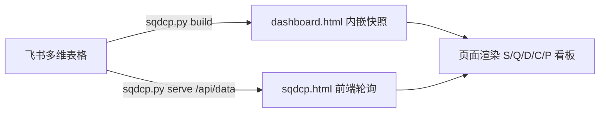

# SQDCP Dashboard 教程

这是一个从「飞书多维表格」读取指标与每日数据，并渲染成 SQDCP 运营看板的项目。看板按安全（Safety）、质量（Quality）、交付（Delivery）、成本（Cost）、人员（People）五个维度展示每日红绿灯、月度均值、达标率与异常清单。

## 1. 项目结构

```text
sqdcp/
├── sqdcp.py              # 单一入口：飞书数据、build、data、serve
├── sqdcp.html            # 页面模板：包含渲染逻辑，生成时会把数据注入其中
└── dashboard.html        # 运行 python3 sqdcp.py build 后生成，可单独打开
```

## 2. 数据流



页面首次加载时，先用生成时内置的数据快照渲染；随后立即请求 `DATA_URL` 获取最新数据，之后每 4 小时轮询一次。接口不可用时自动沿用缓存数据，并在右上角显示“缓存”。

## 3. 数据源：飞书多维表格

程序依赖飞书开放平台读取一个多维表格应用，其中必须包含两张表：

### 指标配置表

| 字段 | 说明 | 示例 |
| --- | --- | --- |
| `指标编号` | 指标唯一编码，建议 `S01`、`Q01`、`D01` 等 | `D01` |
| `指标名称` | 指标中文名 | `出库准时率` |
| `SQDCP分类` | 必须使用 `Safety`、`Quality`、`Delivery`、`Cost`、`People` | `Delivery` |
| `目标值` | 目标值，百分比类建议存小数，例如 `0.98` | `0.98` |
| `目标方向` | `越低越好` / `越高越好` / `不低于阈值` | `越高越好` |
| `单位` | `%`、`次`、`人`、`件`、`LPN`、`小时`、`元` 等 | `%` |

### 每日数据表

| 字段 | 说明 | 示例 |
| --- | --- | --- |
| `指标` | 关联到「指标配置表」记录 | 指向 `D01` |
| `日期` | 日期字段，飞书 API 会返回毫秒时间戳 | `2026-02-08` |
| `数值` | 当日实际值；百分比仍按小数保存 | `0.996` |
| `维度` | 同一指标可有多个口径，如 `实际值`、`准时出库量`、`加班工时` | `实际值` |

每日数据表里一行记录代表“某天、某指标、某维度”的一个数值。同一指标同一天可以有多行不同维度，例如 `D02` 同时有 `准时出库量` 和 `未准时量`。

## 4. 环境准备

需要 Python 3.9+ 和 `requests` 库。

```bash
cd /Users/wangjiacheng/codex大学习/sqdcp

python3 -m venv .venv
source .venv/bin/activate
pip install requests
```

## 5. 配置飞书凭证

程序读取两个环境变量：

```bash
export FEISHU_APP_ID="你的 App ID"
export FEISHU_APP_SECRET="你的 App Secret"
```

如果没设置环境变量，`sqdcp.py` 会使用代码里的默认值。正式使用建议通过环境变量注入，不要把 App Secret 提交到公开仓库。

飞书应用需要具备多维表格读取权限，并且该应用要能访问目标多维表格。

## 6. 用法一：生成静态看板

```bash
python3 sqdcp.py build          # 包含全部年份
python3 sqdcp.py build 2026     # 只保留 2026 年数据
```

脚本依次执行：

1. 获取飞书 `tenant_access_token`
2. 查找 `指标配置表` 和 `每日数据表`
3. 拉取指标配置
4. 分页拉取全部每日记录
5. 把最新 JSON 注入 `sqdcp.html` 并写入 `dashboard.html`

生成后直接双击打开 `dashboard.html` 即可看到内置快照。页面加载时仍会尝试请求 `http://localhost:7700/api/data`，如果本地服务没启动，右上角会显示“缓存”，但看板内容不受影响。

只想检查数据源时，可用：

```bash
python3 sqdcp.py data           # 输出全部年份 JSON
python3 sqdcp.py data 2026      # 只输出 2026 年 JSON
```

## 7. 用法二：本地实时服务

```bash
python3 sqdcp.py serve          # 或直接 python3 sqdcp.py
```

浏览器打开：

```text
http://localhost:7700/
```

服务提供两个路由：

| 路由 | 说明 |
| --- | --- |
| `GET /` | 返回 `sqdcp.html`，同源页面，避免 `file://` 的 CORS 问题 |
| `GET /api/data` | 返回当前年份的 `{metrics, daily, months}` JSON |

`/api/data` 结果会缓存 5 分钟，避免页面刷新时频繁请求飞书接口。修改飞书数据后最多等 5 分钟，或重启服务立即刷新。

所有命令可用 `python3 sqdcp.py --help` 查看。

## 8. 切换数据接口

前端默认请求：

```text
http://localhost:7700/api/data
```

也可以在地址栏用 `api` 参数覆盖：

```text
http://localhost:7700/?api=https://your-worker.example.com/api/data
```

任何返回 `{metrics, daily, months}` 的服务都可以作为数据源，例如 Cloudflare Worker，因此本项目的本地服务也可以替换成远程接口。

## 9. 页面功能

### 顶部

- 月份下拉框：切换当年 1 到 12 月
- 实时状态：显示“实时”或“缓存”

### KPI 卡片

固定展示 6 个核心指标：

- 出库准时率
- 入库准时率
- 质量逃逸
- 技能合格率
- 出勤率（实际出勤 / 在岗编制）
- 加班工时

### 字母日历

中间区域用 S、Q、D、C、P 五个字母形状展示当月每一天的红绿灯。日期数字按字母轮廓顺时针排列，格数会自动匹配当月天数。

绿色表示当日该类别整体达标，红色表示存在异常，灰色表示当天没有记录。

### 指标对比表

按指标主维度计算本月均值，与目标值比较，显示“达标 / 未达标 / 无目标”，并展示与上月相比的环比箭头。

### 雷达图与异常清单

- 雷达图展示五个类别当月“达标天数 / 有数据天数”的百分比
- 异常清单列出每个未达标日期、指标、实际值与目标值

## 10. 红绿灯规则

每个类别在 `sqdcp.html` 的 `CATS` 中定义：

| 类别 | 规则 | 判定方式 |
| --- | --- | --- |
| Safety / Quality | `anyNonZero` | 当天任一指标数值大于 0 即红，全部为 0 才绿 |
| Delivery | `bothTarget` | `D01` 出库准时率与 `D03` 入库准时率都达标才绿 |
| Cost / People | `allTarget` | 当天所有带目标值的指标都达标才绿 |

指标是否达标由 `目标方向` 决定：

- `越低越好`：实际值 <= 目标值
- `越高越好`：实际值 >= 目标值
- `不低于阈值`：实际值 >= 目标值

数值格式化规则：

- `%`：实际值乘以 100 显示，保留 1 位小数
- `次 / 人 / 件 / LPN`：四舍五入为整数
- `小时 / 元`：保留 1 位小数
- 其他：保留 2 位小数

## 11. 常见问题

### 报错 `ModuleNotFoundError: No module named 'requests'`

```bash
pip install requests
```

### 报错 `get_token failed`

检查 `FEISHU_APP_ID` 和 `FEISHU_APP_SECRET` 是否正确，并确认飞书应用已开通多维表格读取权限。

### 报错 `list_tables failed`

检查多维表格 `APP_TOKEN` 是否正确，以及飞书应用是否被添加为表格协作者。

### 看板显示“本月暂无数据”

依次检查：

- 两张表的表名是否为 `指标配置表`、`每日数据表`
- 每日记录的 `指标` 字段是否真的关联到指标配置记录
- `日期` 是否为日期字段
- 当前选择月份是否在该年份内
- 服务接口是否只返回当前年份，而数据填的是其他年份

### 修改飞书数据后看板没变化

本地服务接口缓存 5 分钟；重启 `python3 sqdcp.py serve` 可立即清空缓存。静态模式需要重新运行：

```bash
python3 sqdcp.py build 2026
```

### 端口被占用

修改 `sqdcp.py` 中的：

```python
PORT = 7700
```

## 12. 常见自定义点

| 想改什么 | 改哪里 |
| --- | --- |
| 类别名称、颜色、责任人、判定规则 | `sqdcp.html` 中的 `CATS` |
| 字母形状 | `sqdcp.html` 中的 `LETTER_MASKS` |
| 轮询间隔 | `sqdcp.html` 中的 `POLL_MS` |
| 默认数据接口 | `sqdcp.html` 中的 `DATA_URL` |
| 主维度口径 | `sqdcp.html` 中的 `mainDim()` |
| KPI 卡片 | `sqdcp.html` 中的 `renderKPIs()` |
| 指标字段映射 | `sqdcp.py` 中的 `fetch_data()` |

## 13. 部署建议

简单展示可直接运行 `python3 sqdcp.py serve`。如果看板需要给多人长期访问，建议把读取飞书、返回 JSON 的逻辑放到 Cloudflare Worker 或类似服务上，前端只需把 `DATA_URL` 指向远程接口，或通过 `?api=` 参数覆盖。
